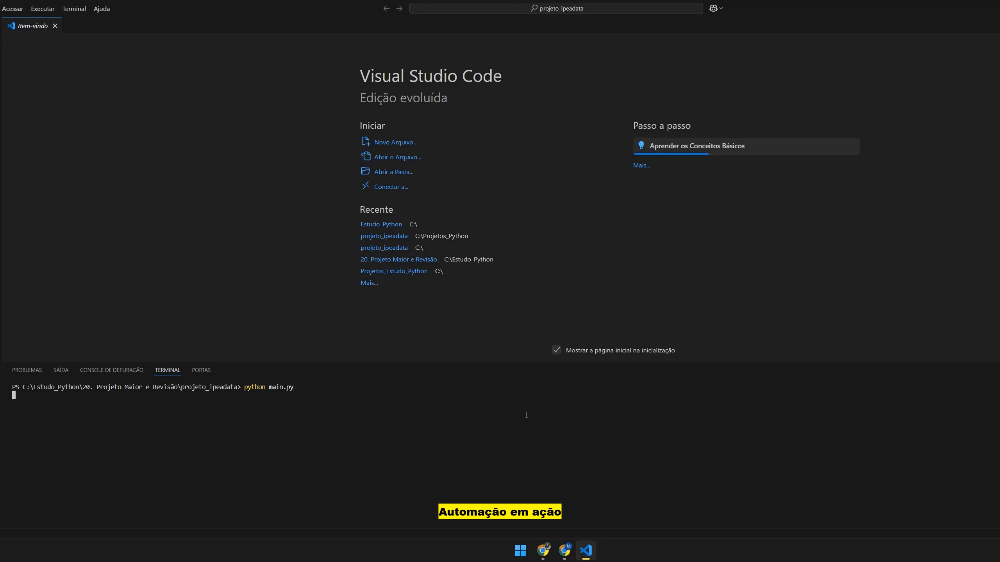

# Bot de Relatórios Automáticos com Dados Econômicos (IpeaData)

Este bot automatiza a coleta de indicadores econômicos diretamente da API do IpeaData, gera visualizações em gráfico (matplotlib) e entrega um relatório completo em PDF por e-mail — eliminando tarefas manuais de pesquisa, formatação e envio.

## Solução implementada
- Consumo de API pública do IpeaData com controle de série personalizada
- Geração automatizada de gráfico com matplotlib
- Conversão do relatório para PDF com layout limpo
- Envio do material por e-mail com autenticação segura

## Tecnologias e ferramentas utilizadas
- Python 3.11
- Bibliotecas: `requests`, `matplotlib`, `pdfkit`, `smtplib`

## Resultados
- Processo reduzido de 30 minutos manuais para 2 segundos automatizados
- Relatório padronizado entregue por e-mail com agendamento possível via cron/script

## Demonstração


## Como executar
- Edite os dados em "config" e execute:
```bash
python main.py
